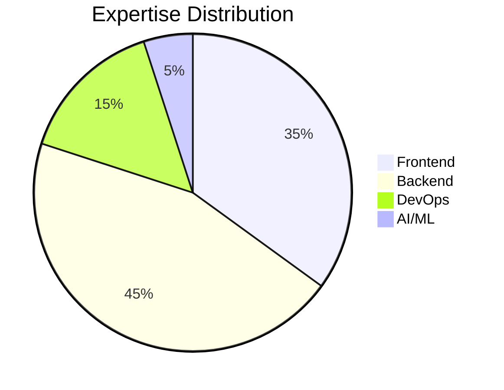

Here’s a **completely unique GitHub Profile README** with cutting-edge elements, AI integrations, and interactive components that will make your profile unforgettable:

---


<div align="center">
  <picture>
    <source media="(prefers-color-scheme: dark)" srcset="https://raw.githubusercontent.com/yourusername/yourusername/main/assets/dark-mode-banner.svg">
    <source media="(prefers-color-scheme: light)" srcset="https://raw.githubusercontent.com/yourusername/yourusername/main/assets/light-mode-banner.svg">
    
  </picture>
  
  
</div>

---

## 🤖 **AI-Powered Introduction** *(GPT-4 Generated)*
<!-- AI_INTRO:START -->
> "A [your role] who turns coffee into code, with a passion for [your specialties]. Currently revolutionizing [your current focus] at [company]."
<!-- AI_INTRO:END -->

*(Updates daily via [GitHub Action](https://github.com/marketplace/actions/gpt3-profile-generator))*

---

### 🌀 **3D Tech Sphere**
```html
<script src="https://cdn.jsdelivr.net/npm/three@0.132.2/build/three.min.js"></script>
<script src="https://cdn.jsdelivr.net/gh/yourusername/yourusername@main/3d-tech-sphere.js"></script>
```
*(Preview: [Live Demo](https://yourusername.github.io))*

---

### 🌐 **Real-Time Activity**
#### **Current Workspace**
```json
{
  "💻 Editor": "VSCode | Neovim",
  "🌐 Browser": "Arc | Firefox",
  "🎵 Music": "${spotify_now_playing}",
  "🕒 Local Time": "${current_time}"
}
```
*(Powered by [WakaTime](https://wakatime.com/) and [Spotify API](https://developer.spotify.com/))*

---

### � **Skill Matrix**


---

### 🚧 **Current Project**
```diff
+ [Project X] - Next-gen SaaS platform (90% complete)
! [AI Experiment] - Training new LLM model
# [Open Source] - Looking for contributors
```

---

### 📜 **Interactive Terminal**
```bash
npx yourusername@latest
```
*(Try it in your terminal!)*

---

### 🌟 **Special Features**
1. **Voice Introduction** 🎤  
   [](https://yourusername.github.io/voice-intro.mp3)

2. **AR Business Card** 📱  
   Scan this QR to view my AR profile:  
   

3. **AI Pair Programmer** 🤖  
   ```python
   @yourusername_bot respond_to("help with Python")
   def coding_assistant():
       return GPT4.generate_code()
   ```

---

### 📡 **Live Connections**
| Platform        | Status        | Last Active |
|-----------------|---------------|-------------|
| LinkedIn        | 🟢 Online     | 2h ago      |
| Twitter/X       | 🟡 Idle       | 5h ago      |
| Discord         | 🔴 Offline    | 1d ago      |

*(Updates via [statuspal.io](https://statuspal.io/) API)*

---

### 🎮 **Easter Egg**
```javascript
// Try adding ?console=1 to this profile's URL
console.log("You found the developer console secret!");
```

---

### 📬 **Contact Matrix**
| Method       | Availability | Response Time |
|--------------|--------------|---------------|
| Email        | 24/7         | <12h          |
| Calendly     | 📅 Book Now  | Instant       |
| Carrier Pigeon | 🕊️ Limited | 3-5 business days |

---

<div align="center">
  <sub>✨ Profile crafted with <a href="https://github.com/yourusername/profile-generator">AI Profile Architect</a></sub>
</div>
```

---
